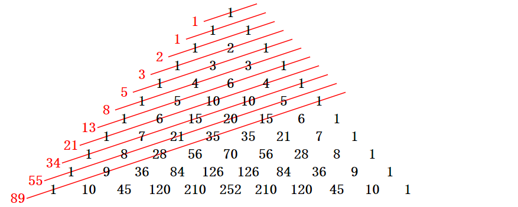

# ABOUT TIKI TOKEN

## Token info

icon: 

    

Token Name: HASHTIKI

Symbol: TIKI

Contract Address:  0xE6C42489218933a7534F501251289272de72aF0C

Decimal: 18

Total Supply: 100,000,000,000 (100 billion) 

Blockchain: Polygon

[Explorer](https://polygonscan.com/token/0xE6C42489218933a7534F501251289272de72aF0C)

## Token distribution

    

- Community Airdrop 52%

  Distributed to community users through HashTribe GameFi and various events. 

- Liquidity 5%

  TIKI Liquidity pools

- Ecological funds 8%

  Used as token repurchase incentives and for ecological expansion, Tiki DAO community governance, rewards for voting.  

- Sell 12% 

  For the promotion of HashTiki, 20% tokens will be released one month after the NFT pre-sale, and the remaining part will be released linearly to investors over 18 months.

- Team 8%

  NFT release starts one month after pre-sale and will be released linearly within three years.

- NFT holder profit 15% 

  As benefits for NFT holders, tokens will be airdropped starting after NFT pre-sale, releasing linearly over a five-year period (the system automatically updates the latest holders every week).
  

# 15% Airdrop Program for NFT Holders

## Yield curve design for NFT holders to obtain TIKI governance tokens:

How to reasonably allocate community governance TIKI tokens to HashTiki NFT holders is a problem that has been designed for a long time. We need to consider the gradual circulation and its impact on the entire ecology.

But the good news is that TIKI adopts Fibonacci number as the reward algorithm for NFT holders

HashTiki is worth having. In this process, we can imagine that people in the future community will grow explosively like Fibonacci numbers, but there are currently only 8,000 HashTiki in total. How to distribute them through a long-term process is a worthwhile Questions to think about!

We can see the arrangement and distribution process of Fibonacci numbers through the figure below, and the number of HashTiki community is also moving in this direction!

So, we have a genius idea, the distribution of TIKI tokens obtained by NFT holders will be distributed according to the **Golden Ratio Sequence**.

We can intuitively see the rules of the golden section sequence, we can try to list the first 20 values:
[1](https://en.wikipedia.org/wiki/1)、 [1](https://en.wikipedia.org/wiki/1)、 [2](https://en.wikipedia.org/wiki/2)、 [3](https://en.wikipedia.org/wiki/3)、 [5](https://en.wikipedia.org/wiki/5)、 [8](https://en.wikipedia.org/wiki/8)、 [13](https://en.wikipedia.org/wiki/13)、 [21](https://en.wikipedia.org/wiki/21)、 [34](https://en.wikipedia.org/wiki/34)、 [55](https://en.wikipedia.org/wiki/55)、 [89](https://en.wikipedia.org/wiki/89)、 [144](https://en.wikipedia.org/wiki/144)、 [233](https://en.wikipedia.org/wiki/233)、 [377](https://en.wikipedia.org/wiki/377)、 [610](https://en.wikipedia.org/wiki/610)、 987、1597、2584、4181、6765……

Yes, we will divide 15% (15 billion) of the total TIKI according to such an imaginative ratio, which may make you think it is very interesting, but it is also a bit complicated.

If we imagine the first 20 numbers as 20 quarters, that's exactly five years.

| 1st year：             |  1 1 2 3    | =7     | 
| :----------------------------- | :---- | :----------- | 
| 2nd year：        |  5 8 13 21    | =47    | 
| 3rd year：     | 34 55 89 144     | =322   |   
| 4th year：  |  233 377 610 987    | =2207  |   
| 5th year： | 1597 2584 4181 6765     | =15087 |

As the number of people in the community is arranged like the golden ratio, the distribution of TIKI tokens will also be arranged in this way.

So we can get the following table. The income issued in each quarter can be derived from this table:

| Q1              1/(1+1+2+3)                       |  0.4285714 billion    |     
| :-------------------------------------- | ---- | 
| Q2                1/(1+1+2+3)                           |   0.4285714 billion   |   
| Q3                2/(1+1+2+3)                          |   0.8571428 billion    |    
| Q4                3/(1+1+2+3)                           |   1.285714 billion   |     
| Q5                5/(5+8+13+21)                      |  0.3191489 billion    |     
| Q6                5/(5+8+13+21)                      |    0.5106382 billion  |    
| Q7                5/(5+8+13+21)                      |  0.8297872 billion    |    
| Q8                5/(5+8+13+21)                    |   1.3404255 billion   |    
| Calculating like this... |    

